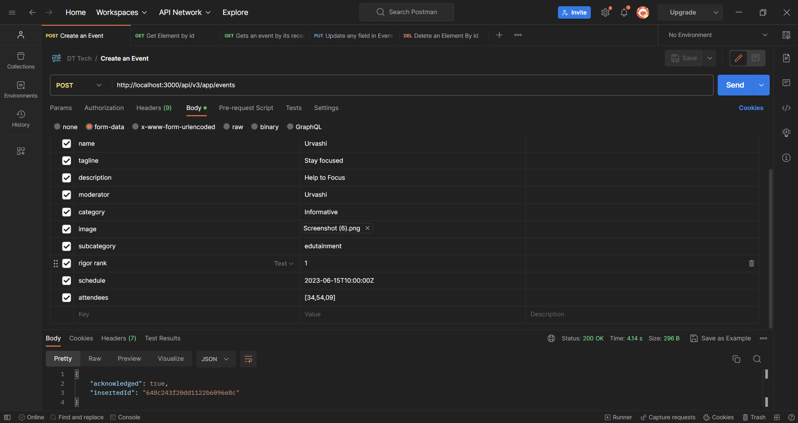
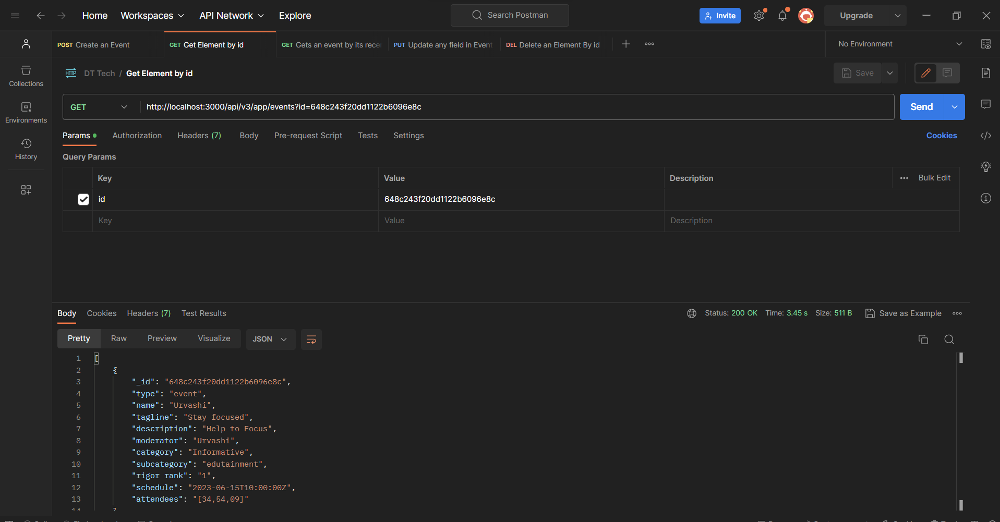
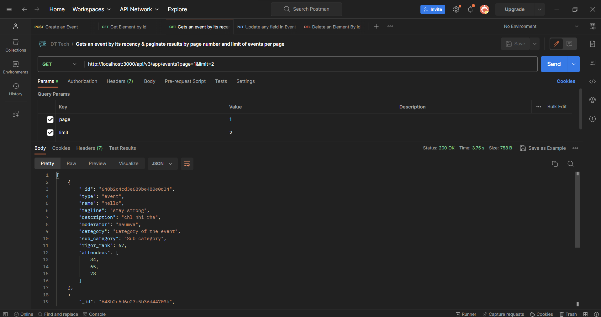
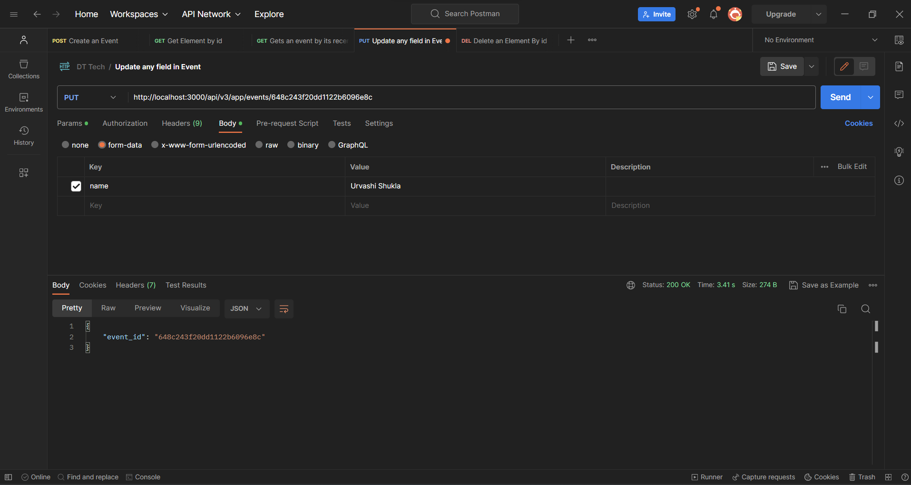
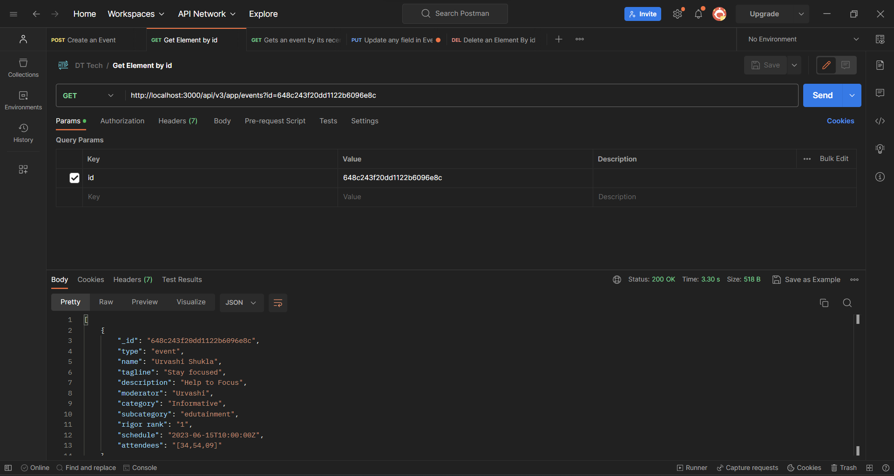
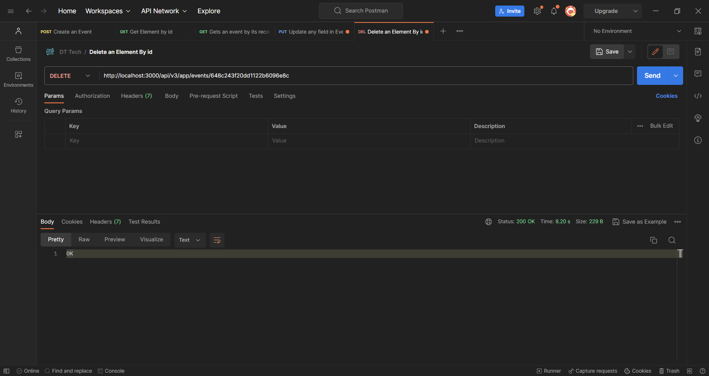
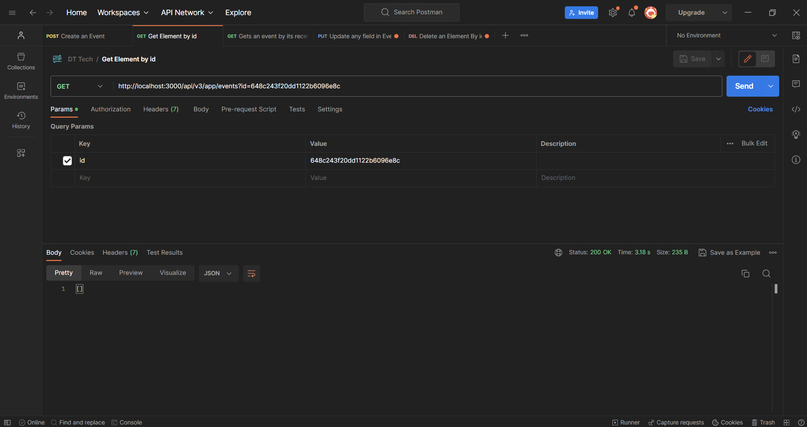

# DT-Tech
#Description
Users can retrieve events by ID, fetch the latest events with pagination, create new events, update existing events, and delete events. The documentation guides users on utilizing these functionalities effectively.

#Api Documentation Link

https://documenter.getpostman.com/view/21529483/2s93shyUsM

## Initiate the creation of a new event and receive the ID of the event that has been successfully created. Ensure to include all the necessary details in the request payload as per the guidelines provided.

Endpoint: `POST /api/v3/app/events`

## Retrieve an event based on its unique ID by specifying the ID of the event using the "id" query parameter.

Endpoint: `GET /api/v3/app/events?id=`

## Retrieves the latest events. You can specify the number of events per page using the "limit" query parameter, and navigate through pages using the "page" query parameter.

Endpoint: `GET /api/v3/app/events?page=`

## Effortlessly modify an existing event by indicating its unique ID through the "id" parameter in the API endpoint. This allows you to precisely specify the event that requires updating.

Endpoint: `PUT /api/v3/app/events/:id`

## Deletes an event specified by its unique ID. Use the "id" parameter in the API endpoint to specify the ID of the event to be deleted.

Endpoint: `DELETE /api/v3/app/events/:id`

